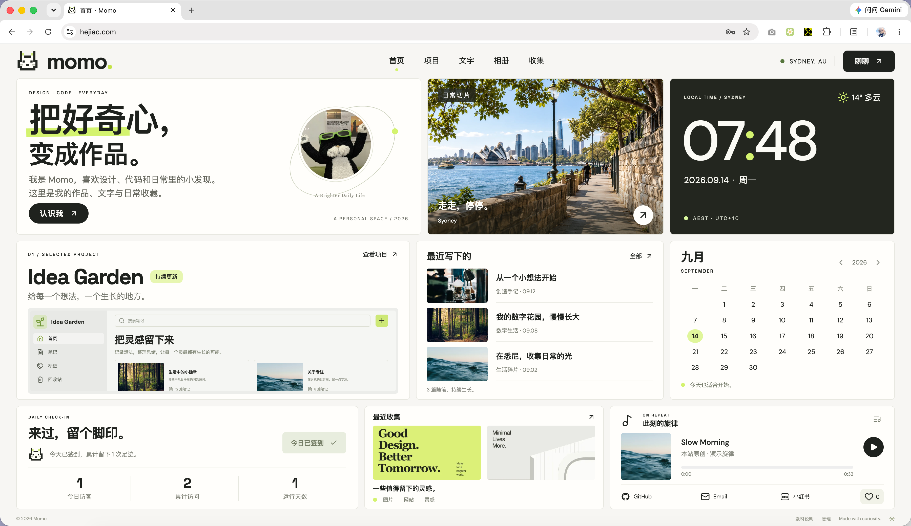

<div align="center">


# Momo Blog

**把好奇心，变成自己的小小网站。**

作品、文字、照片、灵感，还有一首正在循环的歌。<br />
一个可以直接在页面上编辑的 Bento 个人空间。

[](LICENSE)
[](package.json)
[](package.json)
[](#railway-部署)

[看看效果](https://hejiac.com) · [快速开始](#快速开始) · [Railway 部署](#railway-部署) · [使用指南](docs/guide.md) · [反馈建议](https://github.com/snowhejia/momo-blog/issues)

</div>



## 给日常留一个自己的位置

Momo Blog 把个人网站里常用的内容，装进一页有秩序的卡片里。米白底色、墨黑文字、一点青柠，再加一只负责打招呼的像素猫。

你可以用它展示最近做的作品，写下一个小想法，收集喜欢的图片和网站。部署后，登录管理员账号，直接在首页改名字、换头像、上传照片和音乐，让这片空间慢慢变成你的样子。

### 装进这些小事

| 功能 | 你可以做什么 |
| --- | --- |
| ✏️ **直接编辑** | 在页面上修改文字；通过卡片编辑面板管理内容，保存后发布，取消可恢复。 |
| 🧩 **作品与文字** | 项目封面、简介和外链；文章摘要、日期、正文预览，以及可直接分享的详情地址。 |
| 📷 **Bento 相册** | 瀑布流与大小错落的照片卡片；放大浏览、缩略图、键盘切换。首页每次打开随机展示一张。 |
| 🔖 **灵感收集** | 收藏图片、网站和想法，按分类筛选、搜索，保留来源链接。 |
| 🎧 **随身播放器** | 切换栏目继续播放，支持进度和音量；自动读取音频封面，没有封面也有默认唱片。 |
| 💌 **私人留言** | 访客留言只进入管理员的留言箱，可查看、标记和删除。 |
| 🐾 **一点陪伴感** | 每日签到、持久化点赞、访问统计，以及悉尼时钟、日历和天气。 |

**为桌面的一屏设计，也适合随手打开。** 桌面展示完整三行 Bento；窄屏变为两列，手机自然排列为单列。项目、文字、相册和收集拥有独立栏目，顶部导航随时切换。

## 快速开始

需要 **Node.js 24.14–24.x**。先 Fork 到自己的账号，或直接克隆体验：

```sh
git clone https://github.com/snowhejia/momo-blog.git
cd momo-blog
npm ci
npm run build
npm start
```

打开 **[本地首页](http://127.0.0.1:4318)**。macOS 也可以双击项目内的 `start-local.command`。

第一次运行会生成一份独立的示例站：Momo 的资料、Idea Garden 项目、示例文章、照片和原创演示音乐。**仓库不附带管理员账号、私人留言、个人数据库或私密上传内容。**

### 让它变成你的

1. 点击首页底部 **「管理」**，或打开 `/login`。
2. 从运行网站的机器上读取初始化令牌。本地默认执行 `cat data/setup-token.txt`；线上位置见下方部署说明。
3. 填写自己的邮箱和密码（至少 12 位），创建唯一管理员。
4. 点击 **「编辑页面」**，改名字、换头像、添加内容，再点 **「保存修改」**。

项目、文章、照片、收藏和歌曲都支持新增、修改、删除及调整顺序。图片和音乐可以随时替换，不需要改组件。社交入口可配置 GitHub、Email 和小红书。

## Railway 部署

下面适用于**首次部署一个新站**。Momo Blog 包含 Express 后端与 SQLite，需要运行 Node 服务和持久存储，不能只托管静态构建目录。

1. Fork 仓库，在 Railway 新建项目，选择你的 GitHub 仓库。
2. 构建命令使用 `npm run build`，启动命令使用 `npm start`。
3. 给服务添加一个 **Volume**，挂载到 **`/app/data`**，用于保存内容、账号、素材和密钥。
4. 在 **Variables** 中设置以下变量：

   | 变量 | 值 |
   | --- | --- |
   | `HOST` | `0.0.0.0` |
   | `APP_URL` | 你实际访问的完整 HTTPS 地址，例如 `https://your-site.up.railway.app` |
   | `DATA_DIR` | `/app/data` |

5. 部署后生成 Railway 域名或绑定自己的域名。`APP_URL` 要与最终域名保持一致；公开域名的目标端口应与日志中的监听端口一致，程序会读取 Railway 提供的 `PORT`。
6. 进入该服务的 **Console**，执行：

   ```sh
   cat /app/data/setup-token.txt
   ```

7. 复制输出的令牌，在你的网站 `/login` 页面创建管理员。

**线上令牌在服务器里，与你电脑上的令牌不同。** 若自行配置了 `SETUP_TOKEN` 环境变量，则使用该变量的值。创建管理员后，初始化入口自动关闭；日常登录只需要邮箱和密码。

数据库和上传文件必须放在挂载的卷内，才能在重新部署后保留。已有站点添加或更换卷前，应先备份并迁移原数据，不能把新空目录当作原数据目录使用。参见 [Railway 持久卷说明](https://docs.railway.com/volumes) 和 [数据备份指南](docs/guide.md#数据与备份)。

## 轻装开始，内容自己掌握

前台用 React + TypeScript，服务端用 Express，认证用 Better Auth，内容与会话存入 SQLite。照片由 Sharp 处理，音乐信息和封面由 music-metadata 与 FFmpeg 读取。一个项目即可运行前后台。

```text
client/       页面、卡片与前台编辑器
server/       认证、内容接口、媒体处理和数据库
shared/       前后端共享的数据模型
assets/       可替换的示例素材及来源
data/         运行后生成的私有数据，不进入 Git
docs/         预览图片与详细使用说明
tests/        接口与天气测试
```

默认名称和内容只是起点，像素猫是品牌小伙伴。首次种子只在空数据库中导入；使用同一份持久数据更新代码时，不会覆盖你已保存的内容。

### 开发与检查

```sh
npm run dev           # 前台 4317，后台 4318
npm run typecheck     # TypeScript 检查
npm run build         # 构建前后台
npm test              # 独立临时数据库的接口测试
npm run test:browser  # 独立数据目录的浏览器验收
npm run check:publish # 检查 Git 暂存区是否混入私密文件
```

开发配置可参考 `.env.example`。使用开发前台时，将 `APP_URL` 设为 `http://127.0.0.1:4317`；生产配置使用实际访问地址。更多上传限制、保存与取消、备份、接口和浏览器测试设置见 [完整使用指南](docs/guide.md)。

## 几个你可能想知道的事

**可以直接改成自己的站吗？** 可以。页面上的名字、文案、照片、项目、文章、收藏、音乐和社交链接都能在登录后替换；代码也可以继续扩展。

**可以当作完整的多人博客系统吗？** 当前面向单人个人站：一个管理员、固定 Bento 布局、栏目与内容详情。暂不提供多人协作、自由拖拽主题、邮件发送或密码找回。

**编辑失败会丢内容吗？** 保存失败会保留当前草稿；离开有未保存修改的页面会提醒。多窗口编辑使用内容版本检查，避免互相覆盖。草稿不会替代服务器备份。

**时区可以切换吗？** 目前时钟、日历和签到统一使用悉尼时区，自动处理夏令时；还没有后台时区切换设置。

**部署在反向代理后需要额外配置吗？** 需要按实际代理链检查限流的 IP 识别。当前版本的情况和说明见 [反向代理与限流](docs/guide.md#反向代理与限流)。

## 一起把它做得更好

欢迎 Fork 成自己的小站，也欢迎通过 [Issue](https://github.com/snowhejia/momo-blog/issues) 分享建议，或提交 Pull Request。

反馈界面问题时，附上截图、设备尺寸和复现步骤会很有帮助。提交代码前请运行相关检查，并确认没有把数据库、初始化令牌、私密配置或个人素材放进提交里。

如果 Momo Blog 帮你安放了一个作品、一个想法，或者一段日常，欢迎留下一颗 Star。✳

## 许可证与素材

项目代码与文档采用 [MIT License](LICENSE)：可以使用、修改和商用，分发时保留版权及许可声明。

示例照片、字体、头像及依赖保留各自的权利和许可；演示音乐使用 CC0。截图展示的是示例站，画面中的素材不会因此自动变成 MIT 授权。详细信息见 [素材与第三方说明](THIRD_PARTY_NOTICES.md)。

<div align="center">

Made with curiosity. ✳

</div>
